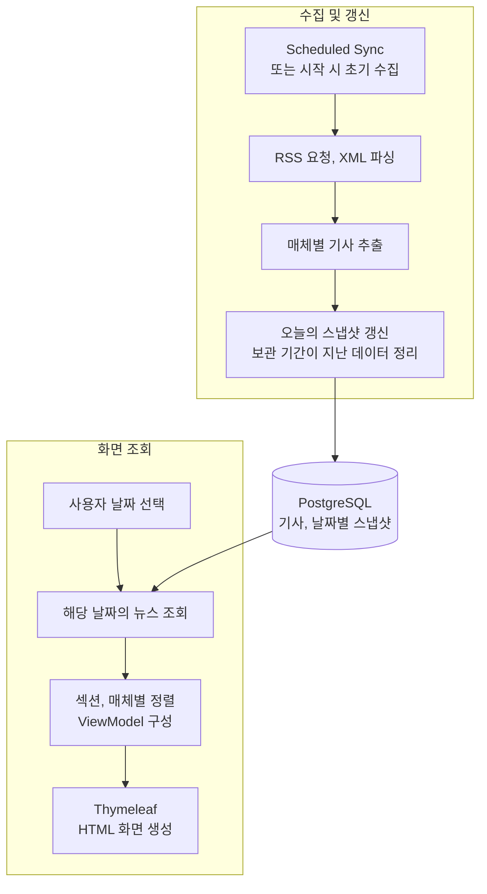

# NEWS-READER

## 1. NEWS-READER 소개
NEWS-READER는 여러 매체의 RSS 뉴스를 모아 날짜별로 조회할 수 있는 웹 애플리케이션이다.

특정 매체에만 의존하지 않고 여러 매체의 헤드라인을 한 화면에서 빠르게 살펴보기 위해 만들었다. 특히 경제 뉴스의 흐름과 요일에 따라 반복되는 특징이 있는지 살펴보고자 했다.

지난주 같은 요일의 뉴스 목록과 비교할 수 있도록 오늘을 포함한 최근 8일의 수집 목록을 날짜별로 보관한다. 보관 기간이 지난 목록은 자동으로 삭제한다.

***
## 2. 주요 기능

- **여러 매체의 뉴스 모아 보기** — RSS 뉴스를 뉴스·경제 섹션으로 나누고 매체별로 모아 보여준다.
- **날짜별 뉴스 조회** — 오늘을 포함한 최근 8일의 뉴스 수집 목록을 보관하며, 좌측 리모트 UI로 날짜를 선택해 지난 목록을 확인할 수 있다.

- **기사 원문 바로가기** — 관심 있는 기사를 선택하면 해당 매체의 원문으로 이동한다.

***
## 3. 기술 구성 및 동작 흐름

### 3.1. 기술 구성

- Java, Spring Boot : 뉴스 수집 및 조회 로직 작성
- Spring MVC, Thymeleaf : 날짜별 조회, HTML 화면 랜더링
- REST Client, DOM API : RSS 요청, XML 파싱
- Java Script, CSS, HTML : 기사 출력, 목록 펼치기, 스냅샷 리모트
- PostgreSQL, Spring data JPA : 기사, 스냅샷 저장 및 조회
- AWS EC2⋅Ubuntu⋅systemd⋅Nginx : 프로세스 관리 및 환경 변수 외부화, 서버 실행 환경 구성

### 3.2. 동작 흐름

- 수집 시점 : 매일 00시, 07시, 18시에 수집을 시행한다. 서버 실행 시 오늘의 스냅샷이 없으면 초기 수집을 수행한다.
- 보관 기간 : 오늘을 포함한 최근 8일의 스냅샷을 유지하고, 지난 데이터는 DB에서 삭제한다.

***
## 4. 주요 설계 결정
### 4.1. 기사 ⋅ 스냅샷 엔티티 분리
지난 뉴스 목록을 다시 살펴보고 흐름을 비교할 수 있도록, 날짜별 수집 상태를 저장하고 조회할 수 있어야 했다.

기사를 수집한 날짜를 기반으로 해당하는 기사의 목록을 스냅샷으로 구성했다.
같은 기사가 여러 날 등장할 수 있으므로 기사 데이터와 날짜별 포함 관계를 분리했다.
기사와 스냅샷은 `ArticleSnapshot`을 통해 다대다 관계로 연결했다.

사용한 RSS에서 날짜가 바뀔 때 목록 전체가 교체되는 것이 아니라, 새 기사가 추가되면서 이전 기사가 목록에서 빠지는 방식으로 갱신되는 것을 확인했다. 따라서 하루 동안 등장한 기사를 모두 누적하기보다, 마지막으로 수집한 목록을 유지하는 것이 뉴스 흐름을 빠르게 살펴보려는 목적에 적합하다고 판단했다.
갱신 시 현재 RSS 목록에서 제외된 기사는 오늘 스냅샷과의 연결을 제거한다.

보관 기간이 지난 스냅샷을 삭제할 때는 기사와의 연결을 먼저 제거하고, 다른 스냅샷에서도 참조하지 않는 기사만 선별해 삭제한다.

### 4.2. 뉴스 수집 ⋅ 갱신과 화면 조회 분리
외부 RSS를 수집, 파싱해 DB를 갱신하는 과정과 스냅샷을 조회해 화면에 출력하는 과정을 분리했다.

뉴스를 실시간으로 갱신할 필요가 없었기 때문에 조회할 때마다 데이터를 요청하는 것은 불필요하다고 판단했다. 더불어 DB에 저장된 데이터를 조회하게 되면, RSS 서버의 일시적 장애 등 외부 변수에 대한 의존도를 낮출 수 있을 것이라고 판단했다.

실제 데이터 요청은 Spring의 `@Scheduled`를 사용해 매일 세 차례 00시, 07시, 18시에 이루어지고, 사용자가 날짜를 선택하면 스냅샷을 DB에서 조회해 출력한다.

정해진 시각에 데이터를 요청하기 떄문에 DB에 저장된 오늘자 스냅샷이 없는 경우를 대비해야 했다. 이를 보완하기 위해 Spring Boot 앱이 시작 시 발생하는 `ApplicationReadyEvent`를 매개로 오늘자에 해당하는 스냅샷의 유무를 확인하고 없다면 수집을 수행하도록 했다.

### 4.3. 매체별 추출 과정 분리
매체마다 제공하는 RSS 데이터의 태그 구성, 종류가 상이해 정보 추출 로직을 분리했다.

`RESTClient`로 응답을 받아오는 과정, XML 문자열을 DOM 트리로 전환하기 위한 파싱 과정은 공통적으로 사용할 수 있어 `NewsService` 클래스에 유지했다. 매체별로 상이한 RSS URL, 그리고 추출 로직은 `NewsSource` 인터페이스의 구현체가 담당하도록 설계했다.

`NewsService`에서 각 구현체를 `List<NewsSource>`로 주입받아 동일한 흐름으로 매체들을 처리할 수 있다. 매체 소스의 추가, 삭제 시 `NewsService`클래스를 수정할 필요가 없다.

### 4.4. 화면 데이터 구성 ⋅ 출력 순서 설정 분리
선택한 날짜의 뉴스를 섹션별, 매체별로 출력하기 위해 `PageViewModel`, `SectionViewModel`, `NewsSourceViewModel`을 구성했다.

출력 순서는 매체의 추출 로직과 별도로 관리할 수 있도록 설정으로 분리했다. `application.yml`에 섹션별, 매체별로 `displayOrder`를 정의하고 `NewsProperties`에 설정값을 바인딩했다. 출력 순서로 사용한 정숫값을 `Comparator`의 정렬 기준으로 사용했고, `List.sort()`으로 정렬 로직을 구성했다.

***
## 5. 문제 해결

[전체 문제 해결 기록](docs/troubleshooting.md)

### RSS 한글 깨짐의 원인 추적

RSS 요청과 XML 파싱은 성공했지만 한글이 깨지는 문제가 있었다. 응답 헤더와 원본 바이트를 확인해 문자열 디코딩 과정으로 원인을 좁혔다. HTTP charset을 우선 사용하고, 없으면 UTF-8을 적용하도록 수정했다. [자세히 보기](docs/troubleshooting.md#11-rss-한글-문자-출력-꺠짐-인코딩-처리)

### 수집 실패 시 기존 데이터 보존

소스별로 예외를 처리하고, 수집·파싱을 마친 뒤 스냅샷 관계를 갱신하도록 했다. NYT RSS URL을 의도적으로 변경해 요청을 실패시킨 후에도, 오늘 스냅샷의 기존 관계가 유지되는 것을 확인했다. [검증 과정](docs/troubleshooting.md#14-수집-실패-시-기존-스냅샷-관계-보존)

### Nginx 기본 페이지가 출력되는 문제

외부 접속뿐 아니라 서버 내부 요청에서도 기본 페이지가 나오는 것을 확인해 Nginx의 사이트 선택 문제로 범위를 좁혔다. 기본 사이트의 활성화 링크를 제거하고 설정을 다시 적용한 뒤 외부 접속을 확인했다. [자세히 보기](docs/troubleshooting.md#42-nginx-기본-사이트와-애플리케이션-프록시-설정-충돌)

그 외 [DB 컬럼 길이·스키마 불일치](docs/troubleshooting.md#22-기사-설명의-varchar255-길이-제한-초과), [Repository 필드명 오류](docs/troubleshooting.md#21-repository-메서드명과-엔티티-필드명-불일치), [sticky 레이아웃](docs/troubleshooting.md#31-flex-레이아웃에서-sticky-위치-고정-문제), [SSH 접속 문제](docs/troubleshooting.md#41-ssh-접속-실패와-네트워크인증-문제-구분)의 원인과 해결 과정도 정리했다.

***
## 6. 배포

***
## 7. 개발 방식

