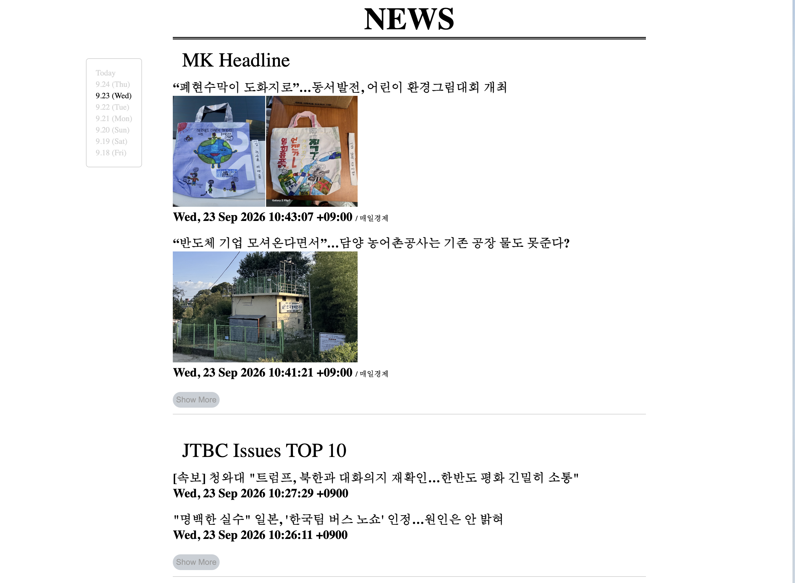
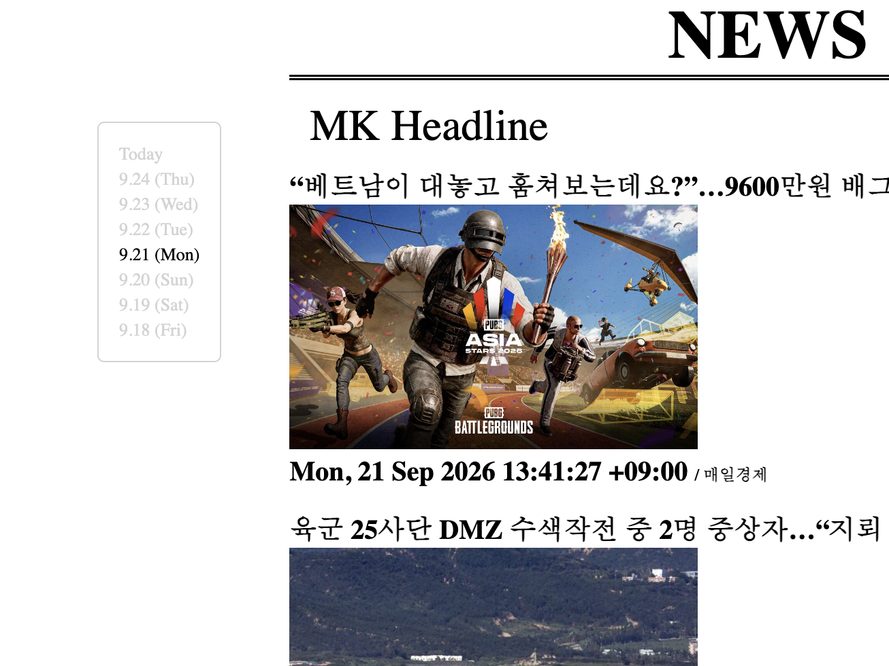
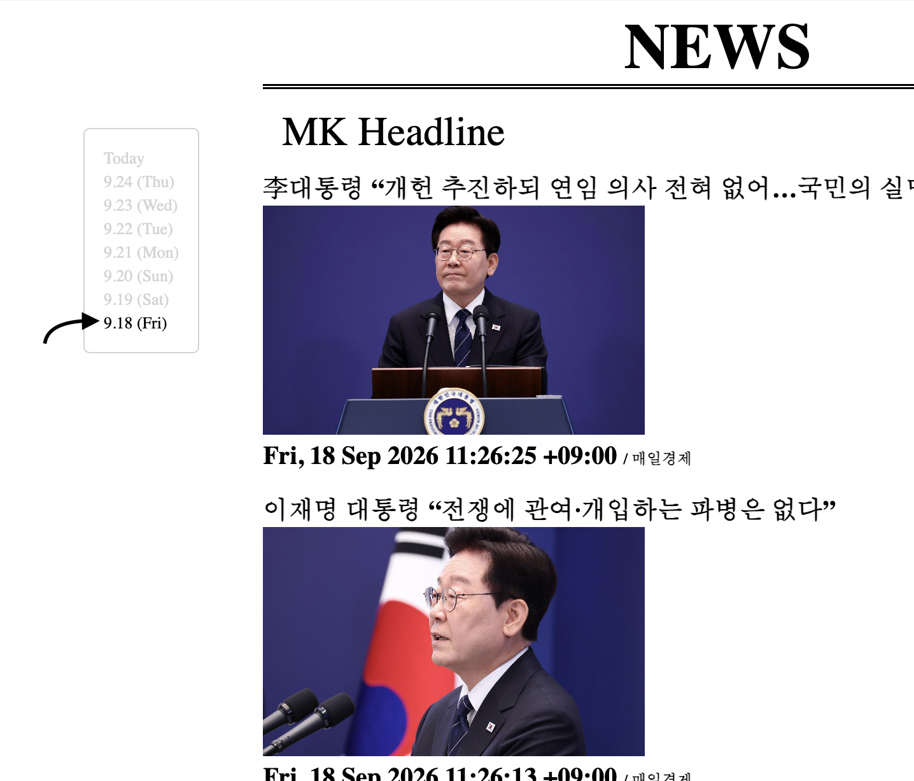
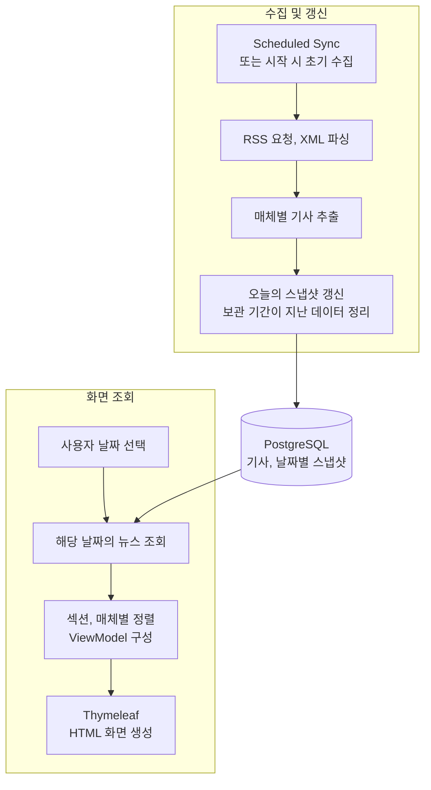

# NEWS-READER

[설계 문서](docs/design.md) · [문제 해결 기록](docs/troubleshooting.md)

## 목차

- [1. NEWS-READER 소개](#1-news-reader-소개)
- [2. 주요 기능](#2-주요-기능)
- [3. 기술 구성 및 동작 흐름](#3-기술-구성-및-동작-흐름)
- [4. 주요 설계 결정](#4-주요-설계-결정)
- [5. 문제 해결](#5-문제-해결)
- [6. 배포](#6-배포)
- [7. 개발 방식](#7-개발-방식)

## 1. NEWS-READER 소개
NEWS-READER는 여러 매체의 RSS 뉴스를 모아 날짜별로 조회할 수 있는 웹 애플리케이션이다.

특정 매체에만 의존하지 않고 여러 매체의 헤드라인을 한 화면에서 빠르게 살펴보기 위해 만들었다. 특히 경제 뉴스의 흐름과 요일에 따라 반복되는 특징이 있는지 살펴보고자 했다.

지난주 같은 요일의 뉴스 목록과 비교할 수 있도록 오늘을 포함한 최근 8일의 수집 목록을 날짜별로 보관한다. 보관 기간이 지난 목록은 자동으로 삭제한다.

***
## 2. 주요 기능

- **여러 매체의 뉴스 모아 보기** — RSS 뉴스를 뉴스·경제 섹션으로 나누고 매체별로 모아 보여준다.
- **날짜별 뉴스 조회** — 오늘을 포함한 최근 8일의 뉴스 수집 목록을 보관하며, 좌측 리모트 UI로 날짜를 선택해 지난 목록을 확인할 수 있다.

- **기사 원문 바로가기** — 관심 있는 기사를 선택하면 해당 매체의 원문으로 이동한다.

***
## 3. 기술 구성 및 동작 흐름

### 3.1. 기술 구성

- Java, Spring Boot : 뉴스 수집 및 조회 로직 작성
- Spring MVC, Thymeleaf : 날짜별 조회, HTML 화면 렌더링
- RestClient, DOM API : RSS 요청, XML 파싱
- JavaScript, CSS, HTML : 기사 출력, 목록 펼치기, 스냅샷 리모트
- PostgreSQL, Spring Data JPA : 기사, 스냅샷 저장 및 조회
- AWS EC2⋅Ubuntu⋅systemd⋅Nginx : 프로세스 관리 및 환경 변수 외부화, 서버 실행 환경 구성

### 3.2. 동작 흐름

- 수집 시점 : 매일 00시, 07시, 18시에 수집을 시행한다. 서버 실행 시 오늘의 스냅샷이 없으면 초기 수집을 수행한다.
- 보관 기간 : 오늘을 포함한 최근 8일의 스냅샷을 유지하고, 지난 데이터는 DB에서 삭제한다.

***
## 4. 주요 설계 결정

[설계 문서 전문 — 실행 흐름, ERD, 구현 코드와 선택 이유](docs/design.md)

### 4.1. 기사와 날짜별 스냅샷 분리

같은 기사가 여러 날짜에 등장할 수 있으므로 기사 데이터와 날짜별 포함 관계를 분리했다. 스냅샷에는 하루 동안 등장한 기사를 누적하지 않고 마지막으로 수집한 목록을 유지한다. 오래된 스냅샷을 정리할 때도 다른 스냅샷에서 참조하는 기사는 남기도록 했다.

[데이터 모델과 갱신 정책](docs/design.md#4-데이터-모델과-snapshot-갱신) · [보존·삭제 정책](docs/design.md#5-데이터-보존과-삭제)

### 4.2. 뉴스 수집·갱신과 화면 조회 분리

화면을 조회할 때마다 외부 RSS를 요청할 필요가 없다고 판단해, 수집은 정기적으로 수행하고 사용자 요청에는 DB에 저장된 스냅샷을 제공하도록 했다. 예약 시각 전에 앱을 시작할 수 있기 떄문에, 시작 시 오늘 스냅샷이 없으면 초기 수집을 수행한다.

[실행 시점과 조회·수집 분리](docs/design.md#2-앱-시작과-수집-실행)

### 4.3. 공통 수집 흐름과 매체별 추출 규칙 분리

HTTP 요청과 XML 파싱은 `NewsService`에 유지하고, 매체별 RSS URL과 추출 규칙은 `NewsSource` 구현체로 분리했다. 구현체들을 `List<NewsSource>`로 주입받아 처리하므로, 새 매체를 추가할 때 공통 수집 로직을 수정하지 않아도 된다.

[공통 처리와 매체별 책임](docs/design.md#3-rss-수집과-매체별-처리)

### 4.4. 화면 데이터와 표시 정책 구성

화면에 필요한 데이터를 페이지·섹션·매체 단위의 ViewModel로 구성하고, 출력 순서는 별도 설정의 `displayOrder`로 관리했다. 날짜 네비게이터도 계산한 날짜가 아니라 DB에 실제 존재하는 스냅샷 날짜로 구성해, 화면에서 데이터가 없는 날짜를 선택하지 않도록 했다.

[조회·정렬과 ViewModel](docs/design.md#6-날짜별-조회와-화면-데이터-구성) · [DB 기반 날짜 네비게이터](docs/design.md#72-네비게이터)

***
## 5. 문제 해결

[전체 문제 해결 기록](docs/troubleshooting.md)

### RSS 한글 깨짐의 원인 추적

RSS 요청과 XML 파싱은 성공했지만 한글이 깨지는 문제가 있었다. 응답 헤더와 원본 바이트를 확인해 문자열 디코딩 과정으로 원인을 좁혔다. HTTP charset을 우선 사용하고, 없으면 UTF-8을 적용하도록 수정했다. [자세히 보기](docs/troubleshooting.md#11-rss-한글-문자-출력-꺠짐-인코딩-처리)

### 수집 실패 시 기존 데이터 보존

소스별로 예외를 처리하고, 수집·파싱을 마친 뒤 스냅샷 관계를 갱신하도록 했다. NYT RSS URL을 의도적으로 변경해 요청을 실패시킨 후에도, 오늘 스냅샷의 기존 관계가 유지되는 것을 확인했다. [검증 과정](docs/troubleshooting.md#14-수집-실패-시-기존-스냅샷-관계-보존)

### Nginx 기본 페이지가 출력되는 문제

외부 접속뿐 아니라 서버 내부 요청에서도 기본 페이지가 나오는 것을 확인해 Nginx의 사이트 선택 문제로 범위를 좁혔다. 기본 사이트의 활성화 링크를 제거하고 설정을 다시 적용한 뒤 외부 접속을 확인했다. [자세히 보기](docs/troubleshooting.md#42-nginx-기본-사이트와-애플리케이션-프록시-설정-충돌)

그 외 [DB 컬럼 길이·스키마 불일치](docs/troubleshooting.md#22-기사-설명의-varchar255-길이-제한-초과), [Repository 필드명 오류](docs/troubleshooting.md#21-repository-메서드명과-엔티티-필드명-불일치), [sticky 레이아웃](docs/troubleshooting.md#31-flex-레이아웃에서-sticky-위치-고정-문제), [SSH 접속 문제](docs/troubleshooting.md#41-ssh-접속-실패와-네트워크인증-문제-구분)의 원인과 해결 과정도 정리했다.

***
## 6. 배포

AWS EC2의 Ubuntu 서버에 실행 가능한 JAR을 직접 배포하고, 외부 브라우저에서 뉴스 페이지에 접속하는 것을 확인했다. Linux 서버에서 앱 실행부터 DB 연결, 프로세스 관리, Reverse Proxy 구성까지 직접 경험하기 위해 선택한 방식이다.

- **PostgreSQL:** 앱과 같은 서버에 구성하고 DB 접속 정보는 환경 변수로 분리했다.
- **systemd:** 앱을 서비스로 등록하고 환경 변수 로드, 부팅 시 실행과 비정상 종료 시 재시작을 설정했다.
- **Nginx:** 외부 HTTP 요청을 80번 포트에서 받아 내부 Spring Boot의 8080 포트로 전달하도록 했다.

[배포 방식과 서버 구성 자세히 보기](docs/design.md#8-배포-방식-선택) · [외부 접속 확인 화면](docs/design.md#ec2-배포-후-외부-접속-확인)

***
## 7. 개발 방식

개인 프로젝트로 요구사항 정리, 구조 설계, 코드 작성, 디버깅과 서버 배포를 직접 수행했다. 챗봇은 개념 학습과 구현 방향에 대한 힌트를 얻는 데 활용했으며, 에이전트가 프로젝트 코드를 직접 작성, 수정, 실행하는 방식은 사용하지 않았다.

