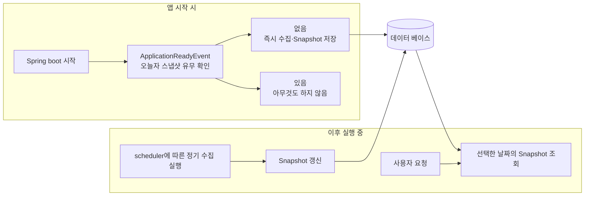
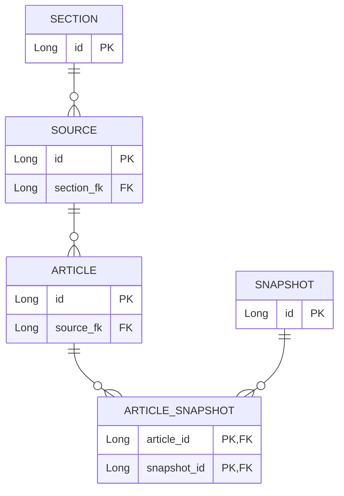
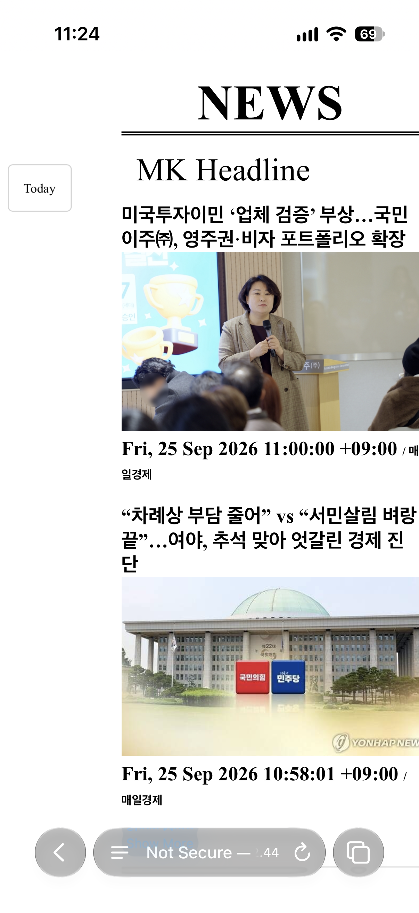

# NEWS-READER의 설계

## 목차

- [1. 목적과 구현 범위](#1-목적과-구현-범위)
  - [1.1. 목적](#11-목적)
  - [1.2. MVP 구현 범위](#12-mvp-구현-범위)
  - [1.3. 현재 범위의 한계와 확장 방향](#13-현재-범위의-한계와-확장-방향)
- [2. 앱 시작과 수집 실행](#2-앱-시작과-수집-실행)
  - [2.1. 전체 실행 흐름](#21-전체-실행-흐름)
  - [2.2. 사용자 조회와 뉴스 수집 분리](#22-사용자-조회와-뉴스-수집-분리)
  - [2.3. 앱 시작 시 초기 수집](#23-앱-시작-시-초기-수집)
  - [2.4. 정기 수집](#24-정기-수집)
- [3. RSS 수집과 매체별 처리](#3-rss-수집과-매체별-처리)
  - [3.1. RSS 수집 흐름](#31-rss-수집-흐름)
- [4. 데이터 모델과 Snapshot 갱신](#4-데이터-모델과-snapshot-갱신)
  - [4.1. 데이터 모델](#41-데이터-모델)
  - [4.2. Snapshot 갱신](#42-snapshot-갱신)
- [5. 데이터 보존과 삭제](#5-데이터-보존과-삭제)
  - [5.1. 데이터 보존 정책](#51-데이터-보존-정책)
  - [5.2. 데이터 삭제](#52-데이터-삭제)
- [6. 날짜별 조회와 화면 데이터 구성](#6-날짜별-조회와-화면-데이터-구성)
  - [6.1. 날짜별 Snapshot 조회](#61-날짜별-snapshot-조회)
  - [6.2. 데이터 그룹화와 정렬](#62-데이터-그룹화와-정렬)
  - [6.3. ViewModel 구성과 전달](#63-viewmodel-구성과-전달)
- [7. 화면 구성과 동작](#7-화면-구성과-동작)
  - [7.1. 화면 구성](#71-화면-구성)
  - [7.2. 네비게이터](#72-네비게이터)
  - [7.3. Show More / Less](#73-show-more--less)
- [8. 배포 방식 선택](#8-배포-방식-선택)
  - [8.1. AWS EC2 선택](#81-aws-ec2-선택)
  - [8.2. 서버 및 데이터베이스 환경 구성](#82-서버-및-데이터베이스-환경-구성)
  - [8.3. 환경 변수 외부화](#83-환경-변수-외부화)
  - [8.4. systemd를 이용한 애플리케이션 실행 관리](#84-systemd를-이용한-애플리케이션-실행-관리)
  - [8.5. Nginx Reverse Proxy](#85-nginx-reverse-proxy)

## 1. 목적과 구현 범위

### 1.1. 목적

이 프로젝트는 생활 전반의 루틴을 관리하는 개인 시스템을 단계적으로 구축하기 위한 첫 번째 프로젝트로 시작했다.

매일 짧은 시간 안에 주요한 소식을 확인하기 위한 형태로 구현하고자 했다.
특히 최근 경제 분야에 대한 관심이 커지면서, 여러 사이트를 직접 방문하지 않고 그날의 주요 기사와 경제 기사를 한 화면에서 확인할 수 있는 형태를 목표로 했다.

단순히 오늘의 기사만 확인하는 것보다 최근 며칠간 어떤 주제가 반복되고 있는지, 추이를 함께 살펴보는 것이 중요해 기사 목록을 날짜별로 저장하고, 최근 1주일의 뉴스 목록을 다시 조회할 수 있도록 구현했다.

또한 한 매체만의 뉴스를 보는 대신 여러 출처의 헤드라인을 함께 배치하여, 동일한 이슈를 서로 다른 매체에서 비교할 수 있도록 했다.

- 제목과 썸네일 위주로 주요 뉴스를 짧은 시간 안에 확인할 수 있는 화면 제공
- 우선적으로 헤드라인 기사와 경제 섹션을 분리하여 관심 정보를 빠르게 탐색
- 날짜별 기사 목록을 저장하여 최근 뉴스의 흐름 확인
- 여러 매체의 기사를 배치하여 매체별 보도 내용을 비교

### 1.2. MVP 구현 범위

첫 버전에서는 뉴스 서비스 전체를 구현하기보다, 실제로 사용할 수 있는 최소 기능에 집중했다.

- RSS를 이용한 뉴스 기사 자동 수집
- Headlines / Economy 섹션 구분
- 총 10개의 뉴스 매체의 기사 제공
- 기사 제목, 썸네일, 원문 링크 제공
- 날짜별 뉴스 스냅샷 저장 및 조회
- 자동으로 뉴스 갱신

### 1.3. 현재 범위의 한계와 확장 방향

현재는 미리 정의된 뉴스 소스, 고정된 화면 표시 순서를 기준으로 동작한다. 뉴스 매체의 추가, 삭제가 자유롭지 않고 화면 출력도 동적으로 조절할 수 없다.
향후에는 다음 방향으로 기능을 확장할 수 있다.

- **뉴스 소스 순서 개인화**
>사용자가 화면에서 소스를 직접 드래그&드랍으로 순서를 변경할 수 있다.

- **RSS 소스의 동적 추가**
>사용자가 RSS URL을 입력하면 XML의 구조를 분석하여 제목, 링크, 작성자, 이미지, 발행일 등에 사용할 수 있는 필드를 제안한다. RSS마다 구조가 다를 수 있으므로 자동 매핑 결과를 바로 확정하지 않고, 사용자가 확인, 수정한 뒤 등록할 수 있도록 한다.


- **기사 원문 미리보기**
>기사 원문으로 이동하기 전 내용을 간단히 확인할 수 있는 미리보기 화면을 제공한다.


- **키워드 기반 기사 묶음과 요약**
>여러 기사에서 반복적으로 등장하는 키워드를 추출하여 보여준다. 사용자가 관심있는 키워드를 선택하면 관련 기사들을 함께 묶어 LLM을 통해 분석한다. 여러 매체의 기사를 종합한 주제별 요약과, 매체별 관점차이를 함께 제공한다.

[목차로 이동](#목차)

***
## 2. 앱 시작과 수집 실행

### 2.1. 전체 실행 흐름


### 2.2. 사용자 조회와 뉴스 수집 분리

NEWS READER는 최근 뉴스 흐름 파악을 목적으로 총 8일간의 기사 목록을 `Snapshot`으로 보관한다. 이에 따라 Persistence가 필요했고, 사용자 조회 경로가 외부 서버에 직접 의존하지 않도록 `Snapshot`을 DB에서 조회하도록 설계했다.

이 구조는 다음과 같은 이점을 가진다.

- **불필요한 네트워크 요청 감소**
>사용자의 조회 요청과 뉴스 수집을 동시에 처리하면, 동일한 정보를 얻기 위해 여러 매체의 RSS 서버에 불필요한 요청을 반복하게 된다. 

- **외부 시스템 장애의 영향 격리**
>사용자 조회 시 외부 RSS 서버에 직접 요청하는 방식은 외부 서버의 일시적인 장애나 느린 응답에 직접적인 영향을 받게 된다. 요청과 수집을 분리하면 외부 데이터 수집 실패가 곧바로 사용자의 조회 실패로 연결되지 않도록 실패 요인을 격리할 수 있다.

### 2.3. 앱 시작 시 초기 수집

- 애플리케이션 실행 시점에 ApplicationReadyEvent를 통해 오늘자 `Snapshot` 유무를 확인한다.
- 오늘자 `Snapshot`이 없는 경우 수집을 실행한다.
- 실제 수집은 `NewsService`의 공통 수집 로직 `syncNews()`에서 이루어진다.

[NewsBootstrap.java](../src/main/java/com/biehn/personal/news_reader/NewsBootstrap.java)


```java
// NewsService
public void syncOnStartupIfNeeded() {
  if (snapshotRepository.findByCollectedDate(LocalDate.now()).isEmpty()) {
    syncNews();
  }
}
```

### 2.4. 정기 수집

- 앱 실행 중에는 `NewsScheduler`가 정해진 시각에 데이터를 수집한다.
- `@Scheduled(cron = "0 0 0,7,18 * * *")` 설정에 따라 매일 00시, 07시, 18시에 실행된다.
- 수집은 `NewsService.syncNews()` 공통 수집 로직에 의해 이루어진다.

[NewsScheduler.java](../src/main/java/com/biehn/personal/news_reader/NewsScheduler.java)

[목차로 이동](#목차)

***
## 3. RSS 수집과 매체별 처리

### 3.1. RSS 수집 흐름

```java
String xml = fetchRss(newsSource.getRssUrl());
Document document = parseXml(xml);
List<NewsItem> newsItems = newsSource.extract(document);
```
```text
RSS URL
  --> HTTP GET
  --> XML String
  --> DOM Document
  --> 매체별 extract()
  --> List<NewsItem>
```

RSS 수집에서 공통적인 흐름은 `NewsService`에서 처리하고, 매체마다 다른 RSS URL과 데이터 추출 방식은 `NewsSource` 인터페이스를 통해 분리했다.

```java
public interface NewsSource {
  String getSourceName();
  SourceId getSourceId();
  String getRssUrl();
  List<NewsItem> extract(Document document);
}
```
#### 공통 책임

- `fetchRss()`
  - HTTP GET 요청
  - Response Body를 XML `String`으로 변환

- `parseXml()`
  - XML `String`을 DOM `Document`로 변환

#### 매체별 책임

- `extract()`
  - 매체별 XML 구조 차이 처리
  - 필요한 tag / attribute에서 값 추출
  - `NewsItem`으로 변환

>요청과 파싱까지 매체별 구현체로 옮기면 같은 코드가 반복되므로 공통 처리 과정은 `NewsService`에 유지했다. 매체마다 달라지는 RSS URL과 추출 규칙만 구현체가 담당하도록 했다.
각 구현체는 Spring Bean으로 등록하고, `NewsService`에서 `List<NewsSource>`로 주입받아 처리한다. 새 매체를 추가할 때는 구현체와 표시 설정을 추가하면 되므로 서비스의 공통 수집 로직은 수정하지 않아도 된다.

[목차로 이동](#목차)

***
## 4. 데이터 모델과 Snapshot 갱신

### 4.1. 데이터 모델

- Article: 기사 자체의 데이터
- Source: 기사의 출처(매체)
- Section: NEWS / ECONOMY 구분
- Snapshot: 특정 날짜의 뉴스 목록
- ArticleSnapshot: 어떤 기사가 어떤 Snapshot에 포함되는지 나타내는 연결 관계


>`Article`과 `Snapshot`은 N:M 관계이므로 `ArticleSnapshot` 연결 엔티티를 통해 두 개의 1:N 관계로 분리했다.
`ArticleSnapshot`은 관계 자체를 표현하므로 `articleId`와 `snapshotId`의 조합을 복합 PK로 사용했다. 별도의 식별자를 추가하지 않고 관계를 식별하면서, 동일한 Article-Snapshot 관계의 중복 저장도 방지한다.

### 4.2. Snapshot 갱신

#### Snapshot 갱신 정책

- **오늘자 Snapshot 확보**
    - 오늘자 `Snapshot`이 존재하면 기존 데이터를 사용한다.
    - 존재하지 않으면 새로운 `Snapshot`을 생성한다.

- **기존 Article 재사용 / 신규 Article 저장**
    - 기사 `link`를 기준으로 기존 `Article`을 조회한다.
    - 동일한 기사가 이미 존재하면 재사용하고, 없다면 새로 저장한다.

- **수집 결과를 바탕으로 관계 갱신**
    - 이번 수집 결과에 없는 기존 `ArticleSnapshot` 관계는 제거한다.
    - 새롭게 수집된 기사는 오늘자 `Snapshot`과 연결한다.
>RSS 목록은 수집 시점마다 갱신되므로, 오늘자 Snapshot은 기사 관계를 누적하지 않고 가장 최근 수집 결과를 기준으로 갱신한다.

- **Fetch 실패 시 기존 상태 유지**
    - 특정 매체의 수집에 실패하면 해당 매체의 기존 관계를 갱신하지 않고 다음 소스 처리를 계속한다.

[목차로 이동](#목차)

***
## 5. 데이터 보존과 삭제

### 5.1. 데이터 보존 정책

최근 뉴스 흐름을 파악하기 위해 오늘을 포함한 최근 8일간의 데이터를 보관한다.

날짜의 기준은 기사의 발행일이 아닌, `Snapshot`이 수집된 날짜 `collectedDate`를 기준으로 한다.

### 5.2. 데이터 삭제

데이터 삭제는 갱신 로직 `syncNews()` 내부 마지막 단계에 이루어진다.
[보관 기간이 지난 데이터 삭제 로직](../src/main/java/com/biehn/personal/news_reader/service/NewsService.java#L221-L245)


#### 삭제 과정

```text
DB에 존재하는 Snapshot을 모두 조회
  ↓
보관 기간이 지난 Snapshot의 ArticleSnapshot 관계 조회
  ↓
각 관계에 연결된 Article 확인
  ↓
ArticleSnapshot 관계 삭제
  ↓
해당 Article을 다른ArticleSnapshot이 참조하는지 확인
  ↓
다른 Snapshot과 관계가 있으면 유지, 없으면 삭제
  ↓
보관 기간이 지난 Snapshot 삭제
```

> `Snapshot`이 보관 기간을 지났더라도 연결된 `Article`을 바로 삭제하지 않는다. 동일한 기사가 다른 `Snapshot`에서도 사용될 수 있으므로 관계를 먼저 제거하고, 더 이상 참조되지 않는 `Article`만 삭제한다.

[목차로 이동](#목차)

***
## 6. 날짜별 조회와 화면 데이터 구성

### 6.1. 날짜별 Snapshot 조회

`/news` 요청에서 조회할 날짜를 결정하고, 해당 날짜의 `Snapshot`을 조회한다.

```text
브라우저 /news 요청
-> date query parameter 확인
-> 있으면 parameter 날짜 / 없으면 현재 날짜
-> Snapshot 조회
```

### 6.2. 데이터 그룹화와 정렬

DB에서 조회한 기사를 화면 구조에 맞게 `Source`와 `Section` 단위로 그룹화하고, `displayOrder`를 기준으로 정렬한다.
출력 순서는 매체의 추출 방식과 별도로 변경할 수 있어야 한다고 판단했다. 따라서 매체 구현체나 DB 조회 순서에 의존하지 않고, `application.yml`에 섹션별, 매체별 `displayOrder`를 정의했다. 

- Source 정렬 기준: `NewsProperties.SourceConfig.displayOrder`
- Section 정렬 기준: `NewsProperties.SectionConfig.displayOrder`

```text
ArticleSnapshot 조회
-> Article / Source / Section 정보 조회
-> SourceId 기준으로 NewsItem 그룹화
-> Source 표시 순서 정렬
-> Section 기준으로 Source 그룹화
-> SectionViewModel List 생성
-> Section 표시 순서 정렬
```
[조회 데이터 그룹화 및 정렬 로직](../src/main/java/com/biehn/personal/news_reader/service/NewsService.java#L279-L360)

### 6.3. ViewModel 구성과 전달

DB의 관계 구조를 화면에 출력할 계층형 구조로 재구성한다.

```text
DB
Snapshot
↔ ArticleSnapshot
↔ Article
→ Source
→ Section

     ↓
화면
PageViewModel
-> selectedDate
-> snapshotDates
-> SectionViewModel List
   -> NewsSourceViewModel List
      -> NewsItem List
```
Controller는 완성된 `PageViewModel`을 `Model`에 담아 Thymeleaf View로 전달하며, View는 Entity를 직접 조회하거나 가공하지 않는다.

```java
model.addAttribute("pageViewModel", newsService.getNewsPage(localDate));
```

[목차로 이동](#목차)

***
## 7. 화면 구성과 동작

### 7.1. 화면 구성

화면은 신문을 연상시키는 흰 배경과 검은 텍스트 중심의 단순한 형태로 구성했다. 좌측에는 날짜를 선택할 수 있는 네비게이터를 배치하고 우측에 정렬된 기사 목록을 배치했다. 
한눈에 헤드라인을 훑을 수 있도록 각 `Source` 기사의 노출을 2개로 제한했으며, 필요 시 펼치고 접을 수 있도록 만들었다.
- 전체 레이아웃

  - 왼쪽 `aside.remote`에 날짜 네비게이터
  - 오른쪽 `article-column`에 `Section` → `Source` → `NewsItem` 순으로 출력
  - 기사 제목/이미지/발행일/작성자 표시
  - 기사 링크는 새 탭이 아닌 현재 탭에서 열리도록 하여, 원문 확인 후 뒤로 가기를 통해 뉴스 목록으로 복귀하는 단순한 탐색 흐름을 유지했다.


- `Thymeleaf` 구조
```thymeleafexpressions
  <div th:each="sectionViewModel : ${pageViewModel.getSectionViewModels}">
    ⋯
    <div th:each="newsSourceViewModel : ${sectionViewModel.newsSourceViewModels}">
      ⋯
      <div th:each="newsItem : ${newsSourceViewModel.newsItems}">
      ⋯
```
> PageViewModel의 계층 구조대로 순회하며 Section → Source → NewsItem 순으로 화면 요소를 생성한다.

### 7.2. 네비게이터

- `flex` 배치
```thymeleafexpressions
<main class="page-container">
  ⋯
  <aside class="remote">
  ⋯
  <div class="article-column">
```
`main.page-container` 에 `flex`를 적용해 네비게이터와 `article-column`를 좌우로 배치했다.

- sticky
```css
.remote {
  position: sticky;
  top: 100px;
  align-self: flex-start;
  display: flex;
  flex-direction: column;
  ⋯
}
```
사용자의 편의성을 위해 네비게이터의 포지션을 `sticky`로 구현했다.

네비게이터가 article-column의 높이만큼 늘어나지 않고 콘텐츠 높이만 가지도록 align-self: flex-start를 적용했다.

내부 날짜표기를 정렬하기 위해 `flex`를 사용했다.

#### 네비게이터 `Thymeleaf` 코드
```thymeleafexpressions
<aside class="remote">
    <a class="date-link"
       th:each="snapshotDate : ${pageViewModel.getSnapshotDates()}"
       th:classappend="${pageViewModel.getSelectedDate().equals(snapshotDate)
            ? 'selected' : ''}"
       th:href="@{/news(date=${snapshotDate})}"
       th:text="${snapshotDate.equals(T(java.time.LocalDate).now())
            ? 'Today'
            : #temporals.format(snapshotDate, 'M.d (EEE)')}"></a>
  </aside>
```
- 날짜 query link

네비게이터에 표시되는 날짜는 `pageViewModel`의 `snapshotDates`를 순회하며 생성한다. 각 반복에서 현재 날짜를 `snapshotDate`로 사용하고, 오늘과 같으면 Today, 그렇지 않으면 월·일·요일 형식으로 표시한다.

>네비게이터의 날짜는 오늘부터 8일을 계산해 만드는 대신, DB에 실제 존재하는 스냅샷의 날짜를 조회해 구성했다. 서버가 실행되지 않아 수집하지 못한 날짜가 있을 수 있으므로, 저장된 데이터와 선택 가능한 날짜를 일치시키기 위해서다. 이를 통해 화면에서 데이터가 없는 날짜로 이동하는 것을 방지했다.

- selected class

각 `snapshotDate`들을 `pageViewModel`의 `selectedDate`와 비교하고 같은 경우 `.selected` class를 추가한다. CSS에서 `.date-link.selected`를 진하게 표시하도록 구현했다.


### 7.3. Show More / Less

많은 기사를 한 번에 노출하면 헤드라인을 빠르게 훑고자 하는 목적에 부합하지 않는다. `Source`의 기사는 기본적으로 2개만 노출하고 필요할 때 전체 목록을 펼칠 수 있도록 구현했다.

기본 상태에서는 CSS의 `nth-child` 선택자를 이용해 세 번째 기사부터 숨긴다.

```css
.news-list > .news-item:nth-child(n + 3) {
  display: none;
}
```

`Show More` 버튼을 클릭하면 JavaScript에서 해당 버튼이 속한 `.source-container`를 찾고, `expanded` class를 toggle한다.

```javascript
const sourceContainer = showButton.closest(".source-container");
const isExpanded = sourceContainer.classList.toggle("expanded");
```

CSS에서 `expanded` class가 적용된 경우 숨겨져 있던 기사들을 다시 표시한다.

```css
.source-container.expanded > .news-list > .news-item:nth-child(n + 3) {
  display: block;
}
```

버튼의 상태에 따라 표시 문구도 `Show More` / `Show Less`로 변경한다.

```javascript
if (isExpanded) {
  showButton.textContent = "Show Less";
} else {
  showButton.textContent = "Show More";
}
```

사용자의 편의성을 위해 목록을 접을 경우 해당 `Source` 영역으로 부드럽게 이동하도록 `scrollIntoView()`를 사용했다.

```javascript
sourceContainer.scrollIntoView({
  behavior: "smooth"
});
```

버튼은 기본 상태에서는 투명도를 낮게 유지해 존재감이 드러내지 않게 의도 했고, 마우스를 올렸을 때 강조되도록 `hover` 스타일을 적용했다.

[목차로 이동](#목차)

***
## 8. 배포 방식 선택

NEWS READER는 AWS EC2의 Ubuntu 환경에 executable JAR 형태로 배포했다.

이번 프로젝트에서는 애플리케이션 기능 구현뿐 아니라 Linux 서버에서 Spring Boot 애플리케이션을 직접 실행시키는 경험을 하는 것을 목표로 했다. 따라서 Docker와 같은 추가 추상화 계층을 사용하지 않고, 애플리케이션 실행부터 프로세스 관리와 Reverse Proxy 구성까지 직접 설정했다.

#### 서버 경로
```text
Browser
-> AWS EC2 :80
-> Nginx
-> localhost:8080
-> Spring Boot
-> PostgreSQL
```

### 8.1. AWS EC2 선택
배포 환경으로 AWS EC2를 사용했고 직접 제어할 수 있는 Linux 서버를 선택하여 다음 흐름을 경험하는 것을 목표로 했다.

- 원격 Linux 서버 접속 및 관리
- JVM 애플리케이션 직접 실행
- 서버 프로세스의 Lifecycle 관리
- 네트워크 포트와 접근 제어
- Reverse Proxy 구성
- 데이터베이스 설치 및 애플리케이션 연결

### 8.2. 서버 및 데이터베이스 환경 구성
서버 내부에는 Java Runtime과 PostgreSQL을 설치하고, NEWS READER 애플리케이션과 데이터베이스를 동일한 서버에서 구성했다.

- Ubuntu
  - 애플리케이션과 데이터베이스가 실행되는 서버 운영체제
- SSH
  - 로컬 환경에서 EC2 서버에 원격으로 접근하고 관리하기 위한 수단
- PostgreSQL
  - 기사, Source, Section, Snapshot 등의 Persistence를 담당
- AWS Security Group
  - EC2 인스턴스로 들어오는 외부 네트워크 접근을 제어

### 8.3. 환경 변수 외부화
DB 접속 URL, 계정, 비밀번호를 애플리케이션 설정에 직접 저장하지 않고 환경 변수로 분리했다. 처음에는 shell의 export를 통해 환경 변수를 일시적으로 주입했지만, 서버를 재시작하거나 새로운 환경에서도 동일한 설정을 유지하고 일관된 관리를 위해 news-reader.env 파일로 외부화했다.

```text
/etc/news-reader.env
-> systemd service
-> Java Process Environment
-> Spring Boot
```

### 8.4. systemd를 이용한 애플리케이션 실행 관리
JAR 파일을 직접 실행할 경우 애플리케이션 프로세스의 Lifecycle을 별도로 관리해야 한다.
NEWS READER는 Spring Boot 애플리케이션을 systemd service로 등록하여 서버의 서비스 프로세스로 관리하도록 구성했다.

systemd는 다음 역할을 담당한다.
- 애플리케이션 JAR 실행
- 실행 사용자와 Working Directory 지정
- 환경 변수 파일 로드
- 서버 부팅 시 애플리케이션 자동 실행
- 비정상 종료 시 재시작
- 애플리케이션 프로세스의 시작 / 중지 / 상태 관리

```text
systemd
-> /etc/news-reader.env 로드
-> java -jar news-reader.jar
-> Spring Boot :8080 실행
```

### 8.5. Nginx Reverse Proxy
Spring Boot 애플리케이션은 서버 내부의 8080 포트에서 실행하고, 외부 HTTP 요청은 Nginx가 80 포트에서 받도록 구성했다.

```text
Browser
-> EC2 :80
-> Nginx
-> localhost:8080
-> Spring Boot
```

Nginx는 외부 요청을 받아 내부에서 실행 중인 Spring Boot 애플리케이션으로 전달하는 Reverse Proxy 역할을 한다.
이를 통해 외부 사용자가 애플리케이션의 내부 실행 포트에 직접 접근하지 않고 일반적인 HTTP 포트로 서비스에 접근할 수 있도록 했다.

#### EC2 배포 후 외부 접속 확인


[목차로 이동](#목차)

